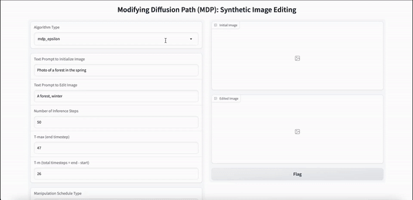

# MDP: Text-guided Image Editing by Manipulating Diffusion Path

MDP focuses on editing images based on the text prompt without training another model. It utilizes the inherent capabilities of the diffusion model to synthesize images. The image synthesis process path can be altered based on the edit text prompt and it will generate the edited image.  

This repository contains extensive codebase for all 4 algorithms mentioned in the original research paper. This repository is inspired from [MDP-Diffusion](https://github.com/QianWangX/MDP-Diffusion) ([arxiv](https://arxiv.org/abs/2303.16765)) implementation. The original repository only contains code for single algorithm mentioned in paper. We have implemented all 4 algorithms mdp_epsilon, mdp_condition, mdp_x, and mdp_beta. We have also included gradio application scripts to try out the technique to edit real as well as synthetic images.  


## Run in a Free GPU powered Gradient Notebook

[](https://console.paperspace.com/github/ashutosh1919/mdp-diffusion?machine=Free-GPU)


## Setup

The file `installations.sh` contains all the necessary code to install required dependencies. This method doesn't require any training but the inference will be very costly and time consuming on CPU since diffusion models are too heavy. Thus, it is good to have CUDA support. Also, you may require different version of `torch` based on the version of CUDA. If you are running this on [Paperspace](https://www.paperspace.com/), then the default version of CUDA is 11.6 which is compatible with this code. If you are running it somewhere else, please check your CUDA version using `nvcc --version`. If the version differs from ours, you may want to change versions of PyTorch libraries in the first line of `installations.sh` by looking at [compatibility table](https://github.com/pytorch/pytorch/wiki/PyTorch-Versions).

To install all the dependencies, run below command:

```bash
bash installations.sh
```


## Running Gradio Demo

MDP doesn't require any training. It uses stable diffusion model and changes the reverse diffusion path based on the edit text prompt. Thus, it enables synthesizing the edited image. We have implemented all 4 algorithms mentioned in the paper and prepared two types of gradio demos to try out the model.

### Real-Image Editing

As part of this demo, you can edit any image based on text prompt. With this, you can input any image, edit text prompt, select algorithm that you want to apply for editing and change algorithm parameters. The gradio app will run the specified algorithm by taking provided inputs with specified parameters and will generate edited image.  

To run this gradio app, run below command:
```bash
gradio app_real_image_editing.py
```

Once you run the above command, gradio app will generate a link which you can open to launch app. Below GIF shows the how you can interact with the app.


### Synthetic-Image Editing

As part of this demo, you can first generate image using text prompt and then you can edit that image using another text prompt. With this, you can input initial text prompt to generate image, edit text prompt, select algorithm that you want to apply for editing and change algorithm parameters. The gradio app will run the specified algorithm by taking provided inputs with specified parameters and will generate edited image.  

To run this gradio app, run below command:
```bash
gradio app_synthetic_image_editing.py
```

Once you run the above command, gradio app will generate a link which you can open to launch app. Below GIF shows the how you can interact with the app.




## Reference

MDP: A Generalized Framework for Text-Guided Image Editing by Manipulating the Diffusion Path -- https://arxiv.org/abs/2303.16765

```
@misc{wang2023mdp,
      title={MDP: A Generalized Framework for Text-Guided Image Editing by Manipulating the Diffusion Path}, 
      author={Qian Wang and Biao Zhang and Michael Birsak and Peter Wonka},
      year={2023},
      eprint={2303.16765},
      archivePrefix={arXiv},
      primaryClass={cs.CV}
}
```


## License

See the [LICENSE](LICENSE) file.
